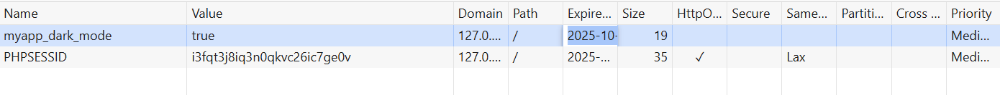
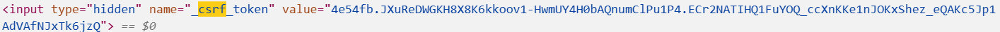

# Sécurisation de l’application *« Bibliothèque »*

## Authentification 48h
- Le temps de connexion est limité à 48 heures grâce au paramètre `lifetime: 172800` dans `security.yaml`.
- Ce paramètre permet la déconnexion automatique après deux jours pour renforcer la sécurité.



## *Cookie* du mode affichage
- Un script JavaScript dans `base.html.twig` crée un cookie `myapp_dark_mode=true` ou `false` selon le mode choisi.
- Ce cookie est visible dans l’onglet **Application → Cookies** du navigateur.
```js
  document.cookie = "myapp_dark_mode=true; path=/; expires=" + new Date(Date.now() + 48 * 60 * 60 * 1000).toUTCString();
```

## Protection CSRF
- Le champ CSRF est activé dans `security.yaml` avec `enable_csrf: true` pour le formulaire de connexion.
- Les formulaires CRUD utilisent la méthode Symfony `$this->isCsrfTokenValid()` pour vérifier la validité du token.



## Vulnérabilités des dépendances
- Les dépendances ont été vérifiées avec la commande :composer audit

## Difficultés rencontrées et solutions

- **Cookie dark mode non persistant au départ**  
  *Problème* : le cookie `myapp_dark_mode` apparaissait comme « Session » (aucune date d'expiration).  
  *Cause* : erreur de syntaxe dans la chaîne JavaScript (`expires` mal concaténé), le navigateur n'interprétait pas l'attribut.  
  *Solution* : correction de la ligne JS pour inclure `expires` correctement ; utilisation d'une date calculée (`new Date(Date.now() + 48 * 60 * 60 * 1000).toUTCString()`).  
  *Leçon* : une petite faute de chaîne suffit à changer le comportement côté client ; tester dans l'onglet Réseau et Cookies du navigateur.

- **Redirection post-login vers la racine   
  *Problème* : après authentification l'utilisateur était renvoyé sur `/` (404).  
  *Cause* : absence de `default_target_path` dans la configuration de `form_login`.  
  *Solution* : ajout de `default_target_path: app_book_index` dans `config/packages/security.yaml`.  
  *Leçon* : vérifier les paramètres par défaut de Symfony après modification du firewall.
